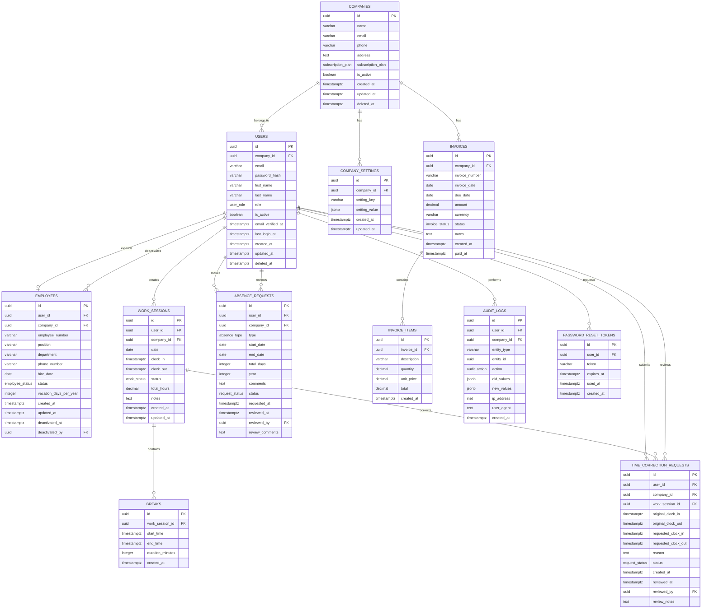

# 📊 Schema de Base de Datos - Diagrama ERD



## 🔗 Relaciones Principales

### 🏢 **Multi-tenancy**
- `COMPANIES` 1:N `USERS` (excepto super_admin)
- `COMPANIES` 1:N `COMPANY_SETTINGS`
- Aislamiento completo por empresa

### 👥 **Usuarios & Empleados**
- `USERS` 1:1 `EMPLOYEES` (solo para empleados)
- `USERS` pueden ser: super_admin, company_admin, employee
- Soft delete en `USERS` y `COMPANIES`

### ⏰ **Time Tracking**
- `WORK_SESSIONS` 1:N `BREAKS`
- `WORK_SESSIONS` 1:N `TIME_CORRECTION_REQUESTS`
- Múltiples sesiones por día permitidas

### 🏖️ **Gestión de Ausencias**
- `ABSENCE_REQUESTS` rastrean vacaciones por año
- Estados: pending, approved, rejected, cancelled
- Auditoría completa de aprobaciones

### 💰 **Facturación**
- `INVOICES` 1:N `INVOICE_ITEMS`
- Soporte multi-moneda
- Estados de facturación completos

### 🔐 **Auditoría & Seguridad**
- `AUDIT_LOGS` para trazabilidad
- `PASSWORD_RESET_TOKENS` con expiración
- Registro de IP y User-Agent

## 📋 Constraints Importantes

### 🔒 **Integridad de Datos**
```sql
-- Super admin no puede tener company_id
CONSTRAINT users_super_admin_no_company

-- Empleados deben pertenecer a la misma empresa que el usuario
CONSTRAINT employees_same_company

-- Fechas válidas en work_sessions y breaks
CONSTRAINT work_sessions_valid_times
CONSTRAINT breaks_valid_times

-- Fechas válidas en absence_requests
CONSTRAINT absence_requests_valid_dates
```

### 🚦 **Enums de Estado**
- **user_role**: super_admin, company_admin, employee
- **work_status**: clocked_out, working, on_break
- **absence_type**: VACATION, SICK_LEAVE, PERSONAL, OTHER
- **request_status**: PENDING, APPROVED, DENIED, CANCELLED
- **subscription_plan**: free, starter, professional, enterprise

## 🎯 **Índices de Performance**

### ⚡ **Consultas Críticas Optimizadas**
- Time tracking por usuario/fecha: `(user_id, date)`
- Consultas por empresa: `(company_id)`
- Búsquedas por estado: `(status)`
- Auditoría por entidad: `(entity_type, entity_id)`
- Solicitudes pendientes: `(company_id, status)`

### 📈 **Escalabilidad**
- Particionado preparado para `work_sessions` por fecha
- Índices compuestos para consultas multi-tenant
- Views optimizadas para consultas frecuentes